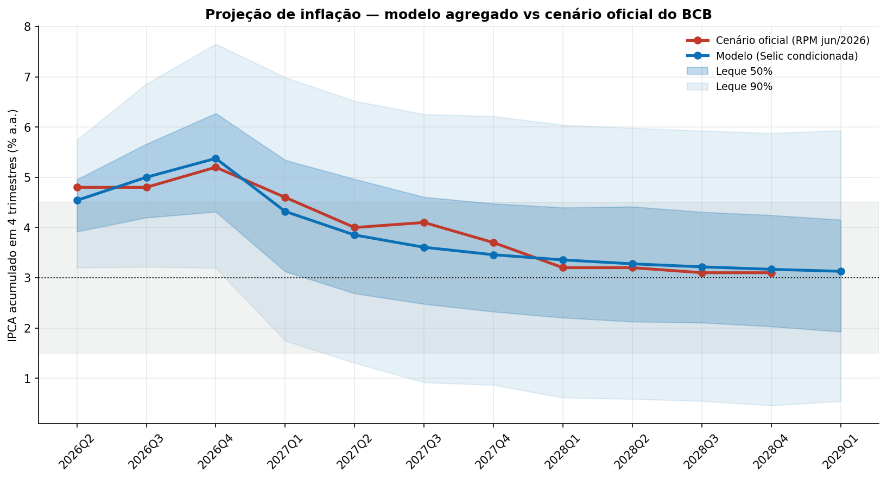
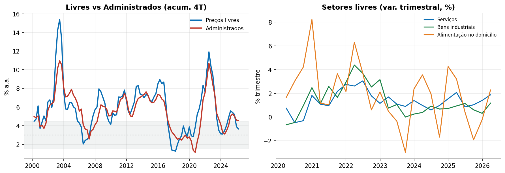
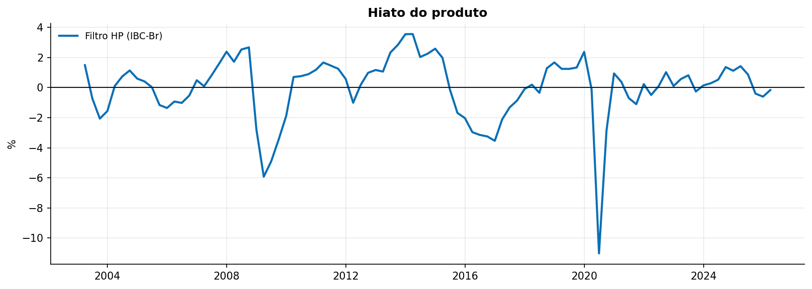
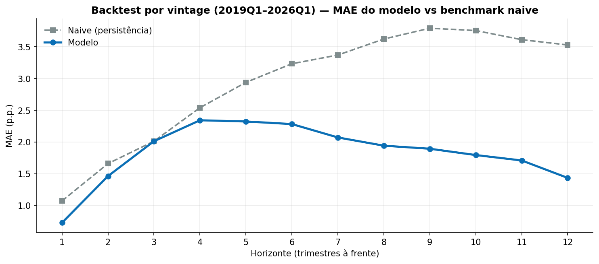
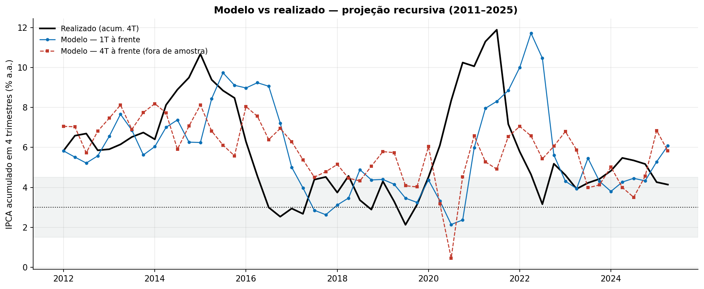
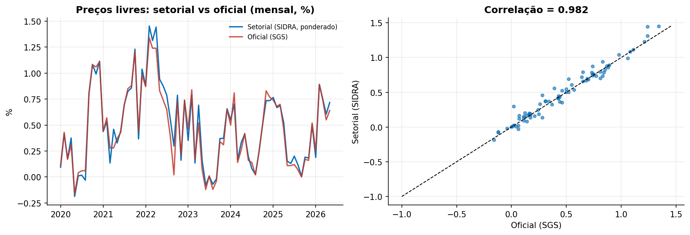

# 🇧🇷 Modelo BCB — réplica do Modelo de Pequeno Porte em Python

**Reconstrução pública do modelo de projeção de inflação do Banco Central do Brasil (MPP)**, com dados point-in-time, equações estimadas, backtest e comparação com o cenário oficial.



> **MAE de 0,20 p.p. contra o cenário oficial do RPM jun/2026** (11 trimestres) — a projeção oficial cai **dentro do leque de 50% do modelo em todos os trimestres**.

---

## 📊 Números principais

| Métrica | Resultado |
|---|---:|
| MAE vs cenário oficial (RPM jun/2026, 11 trimestres) | **0,20 p.p.** |
| Diferença no 1º trimestre (2026Q2) | −0,26 p.p. |
| Cenário oficial dentro do leque 50% do modelo | **11/11** |
| Backtest (29 vintages, 2019–2026) — MAE médio | **1,83 p.p.** |
| Benchmark naive (persistência) — MAE médio | 2,84 p.p. |
| Setorização (livres setorial vs oficial) | **corr 0,98** |
| Long horizon recursivo — MAE 1T / 4T à frente | 0,67 / 2,07 p.p. |

---

## O que é

O Banco Central publica a **estrutura** do seu Modelo de Pequeno Porte (curva de Phillips, IS, regra de Taylor, paridade de juros, expectativas e o bloco de 24 equações de preços administrados), mas não divulga código nem a base tratada. Este repositório reconstrói esse modelo **a partir das fontes documentais do BCB** e valida contra as projeções oficiais.

- **Dados 100% via API pública** (BCB/SGS, Focus, IBGE/SIDRA, NOAA, FRED), com framework **point-in-time** que impede vazamento de informação futura (auditado).
- **Dois modelos**: agregado (Phillips única) e completo (3 Phillips setoriais + estado-espaço).
- Tudo reproduzível e auditável.

## Modelos



| Modelo | Descrição | MAE vs RPM |
|---|---|---:|
| **Agregado** | Phillips livre (restrição novo-keynesiana) + IS + Taylor + UIP + expectativas + admin + hiato HP | **0,20 p.p.** |
| **Completo** | 3 Phillips setoriais (serviços, bens industriais, alimentação) + Kalman + repasse cambial | 1,07 p.p. * |

\* Amostra setorial limitada a 2020+ (SIDRA) — menor robustez, documentado.



## Validação

**Backtest** — para cada vintage (2019Q1–2026Q1), o modelo é re-estimado com dados disponíveis até lá e projeta 12 trimestres. O modelo ganha do benchmark naive em quase todos os horizontes:



**Long horizon** — projeção recursiva modelo vs realizado:



**Setorização** — preços livres setorial vs oficial (corr 0,98):



## 🐳 Abre e usa (Docker)

```bash
# 1. Reproduz tudo (dados → snapshots → modelos → figuras → resumo)
docker compose run pipeline

# 2. Dashboard interativo
docker compose up dashboard   # abre http://localhost:8501
```

Sem Docker, basta `pip install -r requirements.txt` e:

```bash
python main.py                 # pipeline completo + resumo
python scripts/make_figures.py # figuras da documentação
streamlit run dashboard/app.py # dashboard
```

## Como funciona (fluxo)

```
dados brutos (SGS · Focus · SIDRA · NOAA · FRED)
      ↓  point-in-time (available_from por observação)
snapshots por trimestre (pt_2019Q1 … pt_2026Q2)
      ↓
trimestralização + hiato (HP / Kalman)
      ↓
estimação das equações (OLS)
      ↓
sistema simultâneo → projeção 12T → fan chart (Monte Carlo)
      ↓
validação vs cenário oficial (RPM) · backtest rolante · long horizon
```

## Documentação

- [📄 Relatório completo](docs/relatorio.md) — todas as figuras, tabelas e limitações.
- [📐 Equações](docs/equacoes.md) — especificação + 24 itens de administrados (anexo B9 do RPM).
- [🛡 Validação](docs/validacao.md) — metodologia, métricas e auditoria point-in-time.
- [🗂 Fontes de dados](docs/sources.md) · [⏱ Point-in-time](docs/point-in-time.md) · [🏗 Arquitetura](docs/arquitetura.md)

## Limitações honestas

- **IC-Br** com lacuna 2024H2–2025Q3 → Phillips estimada até 2024Q2.
- **Prêmio de risco** (EMBI+/CDS) sem histórico público → absorvido na constante da UIP.
- **Repasse cambial** com sinal negativo na réplica (amostra OLS confundida pela apreciação 2021–23) — diverge do benchmark do BCB.
- **Hiato externo** e **pesos pré-2020** não determináveis nas fontes públicas.

Detalhes e números atualizados em [`docs/validacao.md`](docs/validacao.md).

---

*Implementação e documentação baseadas exclusivamente em publicações do Banco Central do Brasil (RPM/RI e anexos). Não é código oficial do BCB.*
