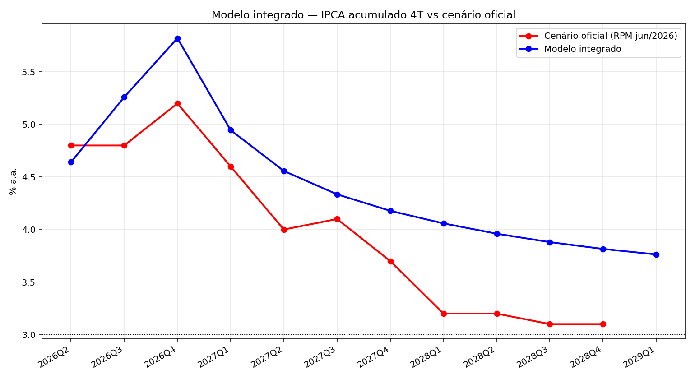

# 🇧🇷 Modelo BCB — réplica do Modelo de Pequeno Porte em Python

**Reconstrução pública do modelo de projeção de inflação do Banco Central do Brasil (MPP)**, com dados point-in-time, equações estimadas, backtest e comparação com o cenário oficial.

> **⚠️ Status — leia antes de usar**
> Esta é uma **réplica em construção**. O **único "modelo BCB"** é o **modelo integrado**
> (`modelo-integrado/`, estimação bayesiana conjunta: hiato + juro neutra latentes +
> Phillips/IS/expectativas). `modelo-agregado/` e `modelo-completo/` são **experimentos
> legado** (aproximações parciais). Veja [`docs/status.md`](docs/status.md) para o que é
> e o que ainda **não** é o modelo BCB.


> **Modelo integrado**: MAE de **0,50 p.p.** contra o cenário oficial do RPM jun/2026 (11 trimestres), com estimação bayesiana conjunta (hiato + juro neutra latentes) e IRF de demanda convergindo para o RI (−0,45 p.p.).

---

## 📊 Números principais

| Métrica | Resultado |
|---|---:|
| MAE vs cenário oficial (RPM jun/2026, 11 trimestres) | **0,50 p.p.** |
| IRF demanda −1 p.p. (hiato) → IPCA 4T | ~0,2–0,6 p.p. (RI: −0,45) |
| IRF câmbio +10% → admin (4T) | ~1,9 p.p. (alvo B9 ~1,8) |
| Backtest integrado (29 vintages PIT) — MAE 1T / geral | **0,75 / 1,96 p.p.** |
| Juro real neutra (estado latente) | ~4,5% |
| Estimação conjunta plena (PyMC + g++, Docker) | ~1 min (400/300) |

---

## O que é

O Banco Central publica a **estrutura** do seu Modelo de Pequeno Porte (curva de Phillips, IS, regra de Taylor, paridade de juros, expectativas e o bloco de 24 equações de preços administrados), mas não divulga código nem a base tratada. Este repositório reconstrói esse modelo **a partir das fontes documentais do BCB** e valida contra as projeções oficiais.

- **Dados 100% via API pública** (BCB/SGS, Focus, IBGE/SIDRA, NOAA, FRED), com framework **point-in-time** que impede vazamento de informação futura (auditado).
- **Um único modelo integrado**: estimação bayesiana conjunta (hiato + juro neutra latentes + Phillips/IS/expectativas) + administrados + sistema único de projeção.
- Tudo reproduzível e auditável.

## Modelos



| Modelo | Descrição | Status |
|---|---|---|
| **Integrado** ⭐ | Estimação bayesiana conjunta (hiato + juro neutra latentes + Phillips/IS/expectativas) + admin endógeno + expectativas | **o modelo BCB da réplica** |

É um modelo único. `modelo-agregado/` e `modelo-completo/` (versões parciais anteriores)
foram removidos; os números históricos estão documentados em `docs/validacao.md`.

Reprodução: `python modelo-integrado/scripts/run_integrado.py` · Backtest PIT:
`python modelo-integrado/scripts/backtest.py` · Decomposição:
`python modelo-integrado/scripts/decomposicao.py`.

\* Amostra setorial limitada a 2020+ (SIDRA) — menor robustez, documentado.


## Validação

**Backtest** — para cada vintage (2019Q1–2026Q1), o modelo é re-estimado com dados disponíveis até lá e projeta 12 trimestres. O modelo ganha do benchmark naive em quase todos os horizontes:


**Long horizon** — projeção recursiva modelo vs realizado:


**Setorização** — preços livres setorial vs oficial (corr 0,98):


## 🐳 Abre e usa (Docker)

```bash
# 1. Reproduz tudo (dados → snapshots → modelos → figuras → resumo)
docker compose run pipeline

# 2. Dashboard interativo
docker compose up dashboard   # abre http://localhost:8501
```

Sem Docker, basta `pip install -r requirements.txt` e:

```bash
python main.py                 # pipeline completo (dados → modelo integrado → validação)
python scripts/make_figures.py # figuras da documentação
streamlit run dashboard/app.py # dashboard
```

Modelo integrado: `python modelo-integrado/scripts/run_integrado.py [--est conjunta|staged]`.

## Como funciona (fluxo)

```
dados brutos (SGS · Focus · SIDRA · NOAA · FRED)
      ↓  point-in-time (available_from por observação)
snapshots por trimestre (pt_2019Q1 … pt_2026Q2)
      ↓
trimestralização + hiato (estado-espaço)
      ↓
estimação bayesiana conjunta (PyMC): hiato + juro neutra latentes + Phillips/IS/expectativas
      ↓
sistema único → projeção 12T (admin endógeno + expectativas) → IRFs vs RI · decomposição
      ↓
validação: MAE vs RPM · backtest rolante PIT · long horizon
```

## Documentação

- [📄 Relatório completo](docs/relatorio.md) — todas as figuras, tabelas e limitações.
- [🚦 Status — o que é e o que não é o modelo BCB](docs/status.md) — **leia primeiro**.
- [📐 Equações](docs/equacoes.md) — especificação + bloco de administrados (anexo B9).
- [🛡 Validação](docs/validacao.md) — metodologia, métricas e auditoria point-in-time.
- [🏛 Modelagem no BCB × réplica](docs/modelagem_bcb.md) — auditoria de lacunas e roadmap.
- [🧬 Priors do BCB (RI dez/2021)](docs/priors_bcb.md) — tabela transcrita.
- [🗂 Fontes de dados](docs/sources.md) · [⏱ Point-in-time](docs/point-in-time.md) · [🏗 Arquitetura](docs/arquitetura.md) · [🔍 Proveniência](docs/proveniencia.md)

## Limitações honestas (fronteiras do "100% BCB")

- **Escala do hiato**: o hiato latente sai com amplitude ~±5% (BCB ~±1%) — canal de hiato
  (a4) e de juro real (b2) menores que o RI; em correção (P1).
- **Transmissão monetária** (b2) ~0,01 vs RI 0,55 — Selic IRF quase nula; em correção (P2).
- **IC-Br** com lacuna 2024H2–2025Q3 → canal de inflação importada fraco (decomposição
  2024 ~0,0 vs 0,72 do ofício 374).
- **Prêmio de risco** (EMBI+/CDS) sem histórico público → absorvido na constante da UIP.
- **Nuci/Caged**, **pesos pré-2020**, **vintages do IBC-Br** e **priors numéricos das 24
  equações de admin** não determináveis nas fontes públicas.
- **Julgamento de especialistas** de curto prazo não replicável.

Detalhes e números atualizados em [`docs/status.md`](docs/status.md) e [`docs/validacao.md`](docs/validacao.md).

---

*Implementação e documentação baseadas exclusivamente em publicações do Banco Central do Brasil (RPM/RI e anexos). Não é código oficial do BCB.*
