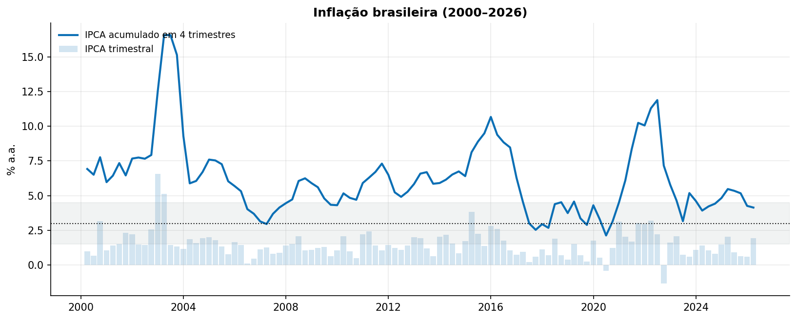
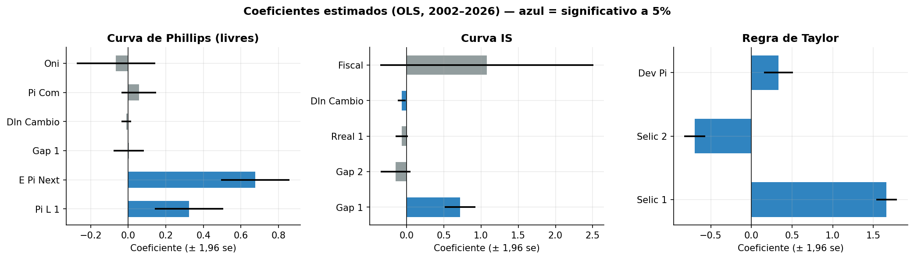
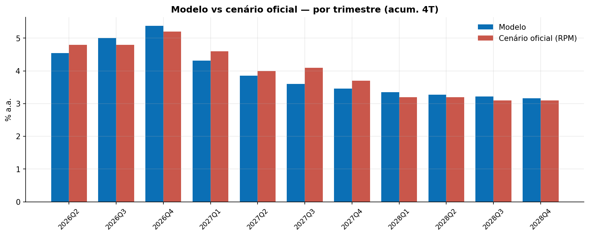
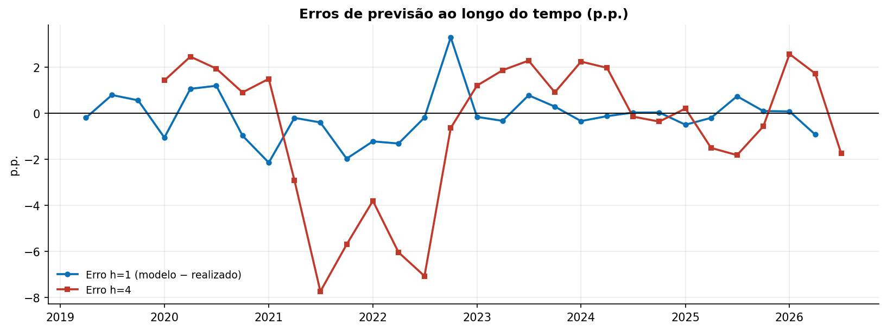
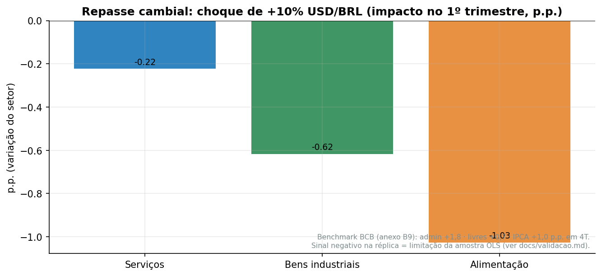

# Relatório — Réplica do Modelo de Pequeno Porte do BCB

Reconstrução pública em Python do modelo de projeção de inflação do Banco Central do Brasil, baseada nas publicações oficiais (RPM/RI e anexos), com dados point-in-time e validação contra o cenário oficial.

**Resultado central:** MAE de **0,20 p.p.** contra o cenário de referência do RPM de jun/2026 ao longo de 11 trimestres; a projeção oficial cai dentro do leque de 50% do modelo em todos os trimestres sobrepostos.

---

## 1. Dados e inflação de referência

IPCA trimestral e acumulado em 4 trimestres (2000–2026), com meta (3%) e banda de tolerância (1,5–4,5%):



Decomposição livre vs administrados e os três setores livres:


## 2. Hiato do produto

Filtro HP (λ=1600) sobre o log do IBC-Br dessazonalizado — a aproximação da réplica para a variável não observável (o BCB usa estado-espaço desde 2020; a versão completa do repositório usa Kalman):


## 3. Estimação — coeficientes

OLS por equação, amostra 2002–2026. Barras em azul = significativos a 5% (intervalo ±1,96 se):



| Equação | Destaques |
|---|---|
| Phillips (livres) | inércia 0,32 · expectativa 0,68 (restrição NK imposta) · hiato ~0,00 (n.s.) |
| IS | persistência 0,72/–0,17 · juro real –0,065 · câmbio –0,062 · fiscal 1,08 |
| Taylor | suavização 1,66/–0,70 · resposta à expectativa 0,33 |
| UIP | diferencial de juros com sinal fraco (prêmio absorvido na constante) |
| Administrados | inércia 0,24 · repasse de livres 0,23 |
| Expectativas | persistência 0,44 |

## 4. Projeção vs cenário oficial (RPM jun/2026)


Comparação trimestral (IPCA acumulado em 4 trimestres):



| Trimestre | Modelo | RPM | Diferença |
|---|---:|---:|---:|
| 2026Q2 | 4,54 | 4,80 | −0,26 |
| 2026Q3 | 5,00 | 4,80 | +0,20 |
| 2026Q4 | 5,38 | 5,20 | +0,18 |
| 2027Q1 | 4,32 | 4,60 | −0,28 |
| 2027Q2 | 3,85 | 4,00 | −0,15 |
| 2027Q3 | 3,61 | 4,10 | −0,49 |
| 2027Q4 | 3,46 | 3,70 | −0,24 |
| 2028Q1 | 3,35 | 3,20 | +0,15 |
| 2028Q2 | 3,28 | 3,20 | +0,08 |
| 2028Q3 | 3,22 | 3,10 | +0,12 |
| 2028Q4 | 3,17 | 3,10 | +0,07 |

**MAE: 0,20 p.p.** · Leque 50% cobre o cenário oficial em 11/11 trimestres.

## 5. Backtest por vintage

Para cada vintage (2019Q1–2026Q1) o modelo é re-estimado com dados **disponíveis até lá** (point-in-time) e projeta 12 trimestres:


| Horizonte | MAE modelo | MAE naive | Ganho |
|---:|---:|---:|---:|
| 1 | 0,73 | 1,07 | ✔ |
| 2 | 1,46 | 1,66 | ✔ |
| 4 | 2,34 | 2,54 | ✔ |
| 6 | 2,28 | 3,23 | ✔ |
| 8 | 1,94 | 3,62 | ✔ |
| 12 | 1,44 | 3,53 | ✔ |

- MAE médio: **1,83 p.p.** vs **2,84 p.p.** (naive/persistência).
- O modelo vence o naive em **63,8%** das 293 observações; o ganho médio é de ~1 p.p.
- Viés médio −0,77 p.p. (subprojeção, concentrada no choque inflacionário de 2021–23).

Erros ao longo do tempo:



## 6. Long horizon — modelo vs realizado

Projeção recursiva (re-estimação a cada trimestre), 2011Q4–2025Q1:


MAE 1 trimestre à frente: **0,67 p.p.** · MAE 4 trimestres à frente (fora de amostra): **2,07 p.p.**

## 7. Modelo completo (desagregado)

3 Phillips setoriais (serviços, bens industriais, alimentação no domicílio) + bloco de administrados + estado-espaço para o hiato:


MAE: **1,07 p.p.** — menor robustez porque a setorização (SIDRA, classificação atual) só cobre 2020+ (~23 trimestres de estimação).

**Repasse cambial** (+10% USD/BRL, choque de nível):



Atenção honesta: nas estimações OLS da réplica o coeficiente de câmbio sai fraco/negativo (apreciação 2021–23 combinada com inflação alta), então o exercício **não reproduz** o repasse positivo do BCB (anexo B9: admin +1,8 · livres +0,7 · IPCA +1,0 p.p. em 4T).

## 8. Setorização

Preços livres construídos dos subitens do SIDRA (classificação por regras + pesos mensais) vs série oficial:


Correlação **0,98**; pesos médios consistentes com a estrutura do IPCA (serviços 45%, industriais 12%, alimentação 15%, administrados 28%).

## 9. Auditoria point-in-time

- 100% das linhas dos snapshots respeitam `available_from ≤ cutoff`.
- Focus com última pesquisa ≤ cutoff; exógenos da projeção ≤ cutoff.
- Corrigidos na auditoria: hiato no long horizon (HP por vintage) e disponibilidade do ONI (NOAA).
- Caveats documentados: lacuna do IC-Br 2024–25, timing da comparação 2026Q2 (base termina em 2026Q1), condicionamento exógeno parcial (só Selic), filtros bidirecionais HP/Kalman.

## 10. Reprodução

```bash
docker compose run pipeline    # tudo em 1 comando
python main.py                 # sem Docker
```

Etapas: `01_download` → `02_build` → `run_aggregate` → `backtest` → `longhorizon` → `run_complete` → `validate_sector` → `make_figures`.

---

*Fonte: Banco Central do Brasil (RPM/RI e anexos), IBGE/SIDRA, NOAA, FRED. Não é código oficial do BCB.*
